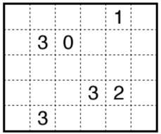

## Five cells puzzle solver
### Five cells puzzle
The rules of the game are :
Divide the grid into regions of exactly five cells ( or pentaminos ).
The number (clue) inside a cell represents how many of its four sides ( including the border of the grid ) are segments of that region's border.

### Solver
The program is written in javascript ( node.js )


The program starts by computing the 8 transformations
( rotations and symmetries ) of the 12 pentaminos.
For each resulting shape, the leftmost cell of the
first row is regarded as coordinate (0,0).

Then it locates the first unassigned cell of the grid and tries to put each shape in turn at that location. If the shape can fit and verifies the clues, it is placed on the grid and the next unassigned cell is recursively processed...

### Execution

The input is provided as a text file.  
For example the following grid :  
  
is coded as :  
```
....1.
.30...
......
...32.
.3....
```

To execute, run the command :   
```
node fivecells.js puzzle.txt
```


